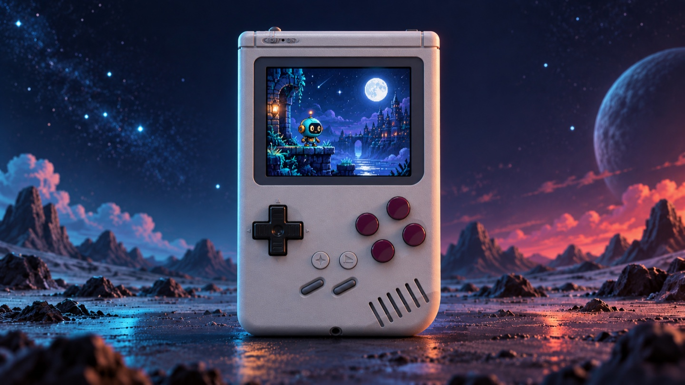
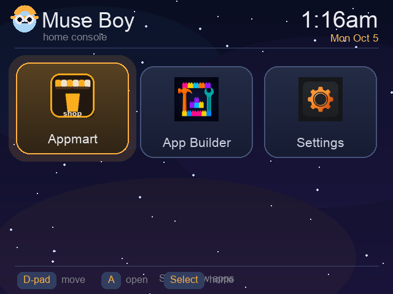
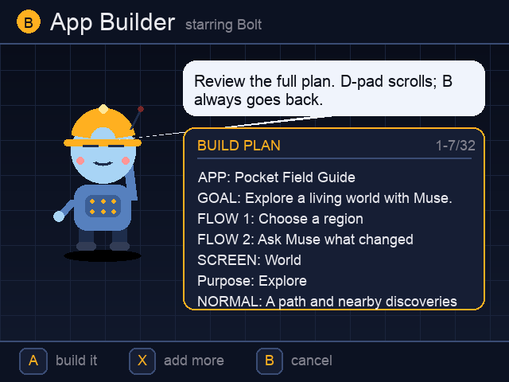
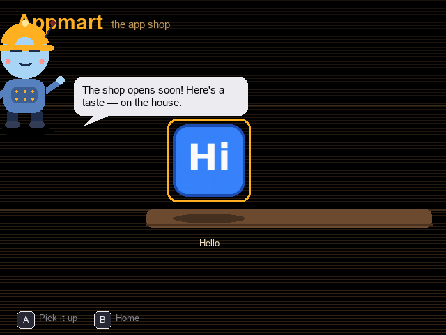
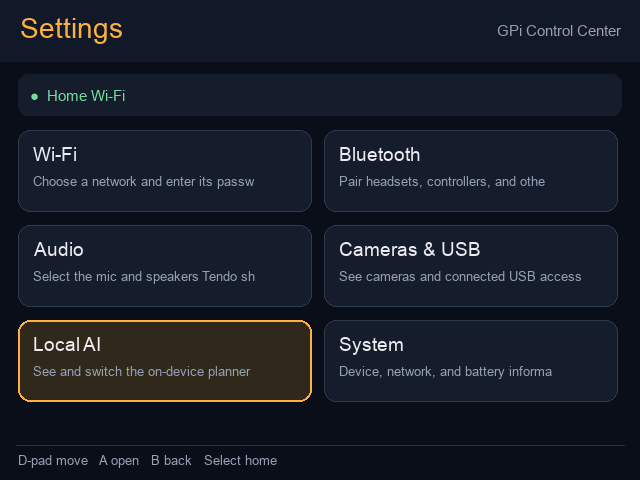
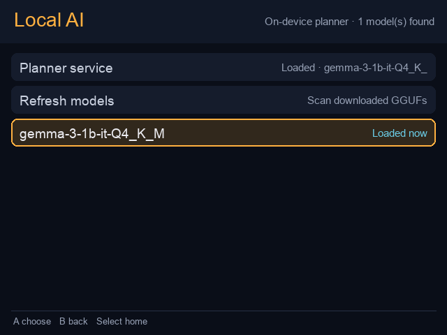

# MuseBoy for the RetroFlag GPi Case 2

<div align="center">
  
  <br>
  <strong>A pocket-sized Muse gadget with local voice tools and a controller-first app hub.</strong>
  <br><br>
  
  
  
  
</div>

MuseBoy brings **Home**, **App Mart**, **App Builder**, and **Settings** to the GPi Case 2. Whisper transcribes voice locally; App Builder sends only that transcript to Muse and notifies Muse when a request is queued. Gemma is not part of the normal voice-to-Muse flow; it can be run separately for local planner experiments.

## Screenshots

These 640×480 previews are rendered from the project's Pygame screens. They are not photographs or captures from a connected GPi. App Mart is shown in its offline demo mode, and App Builder shows a sample plan.

| MuseBoy Home | App Builder |
|:---:|:---:|
|  |  |

| App Mart | Settings |
|:---:|:---:|
|  |  |

| On-device model selection |
|:---:|
|  |

The intended target is a Raspberry Pi Compute Module 4 with eMMC, 8 GB RAM, the RetroFlag GPi Case 2, and Raspberry Pi OS 64-bit Bookworm or a compatible Debian 12 installation with X11. The build and local inference are tuned for the 8 GB CM4. Smaller RAM configurations are not supported by the default Gemma service profile.

## What happens to your voice

App Builder records from the microphone selected in **Settings → Audio**, for up to 60 seconds (press **B** to stop sooner). Whisper transcribes on the GPi and shows the exact words it heard; press **A** to send and authorize the build or **X** to record again. A one-word result is rejected so accidental noise is not sent as an app request. For a new idea, the request metadata marks `operation: create_new_app`. When you choose an installed app with **X**, the request marks `operation: modify_existing_app` and includes that app's ID and name; Muse is instructed to update that exact app in place, preserve its ID, and not create a duplicate. Muse receives exactly `requests/<id>/transcript.txt` and `meta.json`; the GPi never creates `builds/<id>/status.json`. Once queued, App Builder uses the Muse SDK's `send-user-msg` command to notify Muse which request folder is ready. If messaging is offline, the notification retries while the request remains safely queued. When Muse publishes a plan preview waiting for approval, Builder creates Muse's `approved` marker using the user's original A authorization, so there is no second approval prompt. Muse owns its status file, which Builder reads for progress. The WAV is deleted after a usable transcript is made and is never included in a Muse request. Settings → Audio also has a live mic-level check; it samples the selected input while active and does not save audio.

Gemma is not called when recording, transcribing, or submitting a normal App Builder request. To exercise the local structured planner separately, run it with a typed transcript; it prints a local JSON plan and sends nothing to Muse:

```sh
python3 /opt/gpi/apps/builder/local_plan.py --text "Make a tiny offline todo list"
```

Muse publishes progress only when it reaches a real milestone. Bolt displays the reported stage, any percentage Muse explicitly reports, and the age of Muse's last status update. It never derives percentage from elapsed time. A status older than three minutes is labeled stale; the worker's milestone cadence is about two minutes, so age naturally grows between updates.

## First setup

1. Use Raspberry Pi Imager to install a current 64-bit Raspberry Pi OS Bookworm image to the **CM4 eMMC**. The eMMC must be exposed through the GPi's rear programming port using `rpiboot`; a microSD card does not replace the eMMC on an eMMC CM4. Set a named login, Wi-Fi, and SSH if desired. Do not put Wi-Fi passwords, SSH private keys, or Muse SDK tokens in this repository.
2. Boot the CM4 in the GPi and connect it to the network. From a terminal, clone this project and run the GPi display/power patch if it is not already installed:

   ```sh
   git clone https://github.com/Qureshi-Inc/museboy-gpi.git
   cd museboy-gpi
   sudo ./scripts/enable-gpi2-display.sh
   sudo reboot
   ```

   This patch uses the CM4's DPI GPIO display timing and `gpio-shutdown` power-button overlay. It backs up `config.txt` before adding the include. The RetroFlag repository's own safe-shutdown installer is written for RetroPie/Recalbox/Batocera; do not pipe its RetroPie script into a stock Debian install. RetroFlag documents that its dock display choice is sampled at power-on. Hot docking is not guaranteed. HDMI switching still depends on the dock, cable, monitor, and CM4 output configuration; verify it on your hardware.
3. After reboot, install the four-app stack and local runtimes:

   ```sh
   cd ~/museboy-gpi
   sudo ./scripts/install.sh
   ```

   The installer downloads Whisper's tiny English weights and a Gemma 3 1B Q4 model after asking you to review and accept Google's Gemma terms. The model is about 0.8 GB. Its checksum is verified. The launcher and local model service are enabled at boot.
4. Create a personal Muse SDK token at [gadgets.muse.ai/settings/sdk-tokens](https://gadgets.muse.ai/settings/sdk-tokens). This one-time SDK credential is separate from Bluetooth pairing. Enter it in **Settings → Bluetooth → Muse SDK token** using the GPi keyboard, or configure it from your computer over SSH (easier than typing on the handheld): from a computer with this repo cloned, run `./scripts/set-muse-token-remote.sh <ssh-user>@<gpi-ip>`. The helper prompts for the token without echoing it, transfers it over SSH, and writes it to root-only storage at `/var/lib/musegadget/sdk_token` with mode `0600`; the token is not placed in shell history or command arguments. SSH must be enabled and the GPi reachable; the helper may prompt for the GPi login and sudo passwords in their normal secure prompts.
5. In **Settings → Bluetooth → Pair this GPi with Muse**, then in the Muse phone app turn on Developer Mode and select **Settings → Devices → Add Device**. Choose the nearby `MuseGadget…` device. The SDK opens BLE pairing for ten minutes. No Tailscale account or QR scan is required for ordinary Muse pairing.

**No Cloudflare sign-in is needed.** MuseBoy connects to the shared MuseBoy App Mart automatically at [museboy.interestingsoup.com](https://museboy.interestingsoup.com). Cloudflare is managed by the marketplace operator; it is not part of device setup, Muse SDK token entry, Bluetooth pairing, App Builder, or Settings.

After first pairing, MuseBoy sends one message in your Muse chat asking permission to read the App Builder skill at `/opt/gpi/apps/builder/SKILL.md`. Reply **yes** once to let Muse read that file and use it for future app builds; the prompt is not repeated. Until you agree, MuseBoy does not ask Muse to read the skill. If you decline, ordinary transcript handoff continues using the built-in handoff contract.

**Optional remote access:** Tailscale is off by default and is not needed to pair Muse. To add it during setup, run:

```sh
sudo ./scripts/install.sh --tailscale
```

That flag installs Tailscale and displays its sign-in QR code. Omitting the flag leaves Tailscale out of the installation.

## Using the four apps

- **MuseBoy Home:** D-pad moves through the grid; A opens an app; B or Start returns; Select returns Home from a running app.
- **App Mart:** connects to the shared MuseBoy App Mart; left/right browses, A opens an app, X opens its D-pad search keyboard, Y cycles categories, and **Start opens My installed apps** (Start on that screen returns to the shelf). The install animation slots the app into your pocket; installed apps show **ON DEVICE**, and their detail action changes to **Remove it**. In My installed apps, A asks Muse for a description and category from the existing app files; Muse does not rebuild or edit the app. Review those details, then enter or edit the public author/byline. App Mart remembers the last successfully used byline and pre-fills it on the next share. If Muse is unavailable, you can retry or use the saved app details. Contributor access is required. X opens a confirmation to remove an app from this GPi; its marketplace listing remains published. Browsing and downloads need no Cloudflare account or key. B returns. The included local demo shelf works offline if the network is unavailable.
- **App Builder:** press A to record a new idea, or X to choose an installed app to update. Recording lasts up to 60 seconds; B stops early. After local transcription, Builder sends Muse only the transcript. Select returns Home; the local job remains recoverable in **Y → Jobs**.
- After a build finishes, press X to jump directly to App Mart with that app selected for sharing. Press A; Muse quickly reads the already-built app’s `app.json` and README and returns its description and category without changing the app. Review those details, then edit or submit the prefilled author name with the D-pad keyboard. App Mart sends it to the private review queue, where a reviewer must approve it before it appears in the catalog. Contributor access is separate from the private reviewer token. The reviewer opens [museboy.interestingsoup.com/review.html](https://museboy.interestingsoup.com/review.html).
- **Settings:** choose Wi-Fi and enter passwords with the D-pad keyboard; pair Bluetooth audio/controller devices; choose microphone and speaker; inspect USB cameras; enter/pair Muse; and review local model status.

In **Settings → Local AI**, the first row shows the model currently loaded by llama.cpp. GGUF files placed in `/opt/gpi/local-ai/models/` appear below it. Select a supported downloaded model to reload the optional local planner. MuseBoy marks models over 2.5 GB as too large for its configured memory limit. Other GGUF models may vary in JSON-plan quality and speed. The default Gemma model is available for isolated planner experiments only; it does not draft or approve plans in the normal Muse handoff.

To add a model, copy its `.gguf` file into `/opt/gpi/local-ai/models/`, then set ownership and permissions:

```sh
sudo install -m 0644 your-model.gguf /opt/gpi/local-ai/models/
```

Restart the app or use **Settings → Local AI → Refresh models**. Only download models whose license and use terms you have reviewed.

## Engineering notes

- Local planner API binds to `127.0.0.1:8089`; it is not exposed to the network.
- The llama.cpp and whisper.cpp ARM64 runtime binaries are statically linked and included. Source commit IDs and notices are in [`THIRD_PARTY.md`](THIRD_PARTY.md).
- Model weights are downloaded separately and are not in Git. Gemma is subject to Google's terms. Whisper's tiny English model is MIT-licensed.
- Muse's Linux Device SDK is installed from its upstream installer at setup. Each owner supplies a personal SDK token. Muse commands run as the unprivileged `tendo` account without general sudo rights; the SDK can read and modify files available to that account. Review the official SDK security and token terms before pairing.
- Local model selection is limited to valid GGUF files no larger than 2.5 GB. The service reserves memory for the UI, audio, and operating system. Large context windows or bigger models may be slow or fail on a CM4.
- Use the GPi power switch and wait for shutdown to finish. The bundled GPIO overlay sends an orderly system power event; verify safe shutdown after installation.

## Tests

Run host-side planner and model inventory tests with:

```sh
python3 -m unittest discover -s tests -v
python3 -m compileall -q launcher common apps input
bash -n scripts/*.sh
```

On the CM4, check the local services with `systemctl status gpi-local-llm gpi-console gpi-input`. In Settings → Audio, select **Mic level check**, speak, and verify its meter moves; press A again to stop. App Builder also shows a live input-level visualization while recording, using the same PulseAudio default microphone stream saved for transcription. Speak and confirm the bars respond before recording an idea. Verify its transcript, then press A. Confirm `requests/<id>/` contains only `transcript.txt` and `meta.json`, and that the device has not created anything in `builds/<id>/`. Gemma can be exercised separately with the typed-transcript command above.

## Upstream hardware references

- [RetroFlag GPi Case 2 scripts](https://github.com/RetroFlag/GPiCase2-Script) — their instructions warn to apply the display patch before their safe-shutdown installer and describe selecting the LCD or HDMI when powering on.
- [Muse Linux Device SDK](https://github.com/facebookincubator/muse-gadget-sdk/tree/main/linux) — SDK token, Bluetooth pairing, account permissions, and service operation.
- [Muse Gadget SDK token terms](https://gadgets.muse.ai/sdk-terms).
- [Tailscale CLI](https://tailscale.com/docs/reference/tailscale-cli) — optional `tailscale up --ssh --qr` sign-in.
